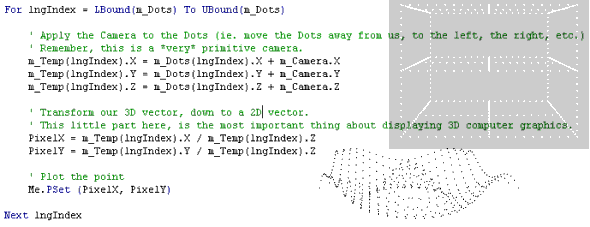



## A 3D Lesson v2, Very Simple

### Description

This 3D application shows you just how simple 3D computer graphics can be to program. Pure VB code and the only mathematics is division. Simple hey?

Objects that are far away, appear smaller. Thus simply divide our 3D object's X and Y coordinates by it's Z coordinate.

NewPixelX = X / Z

NewPixelY = Y / Z

That's all you need for 3D computer graphics, and that's all this program does.
 
### More Info
 

             |
---                |---
**Submitted On**   |2003-07-23 13:24:02
**By**             |[Peter Wilson](https://github.com/Planet-Source-Code/PSCIndex/blob/master/ByAuthor/peter-wilson.md)
**Level**          |Beginner
**User Rating**    |5.0 (99 globes from 20 users)
**Compatibility**  |VB 6\.0
**Category**       |[Graphics](https://github.com/Planet-Source-Code/PSCIndex/blob/master/ByCategory/graphics__1-46.md)
**World**          |[Visual Basic](https://github.com/Planet-Source-Code/PSCIndex/blob/master/ByWorld/visual-basic.md)
**Archive File**   |[A\_3D\_Lesso1619177232003\.zip](https://github.com/Planet-Source-Code/peter-wilson-a-3d-lesson-v2-very-simple__1-47100/archive/master.zip)

